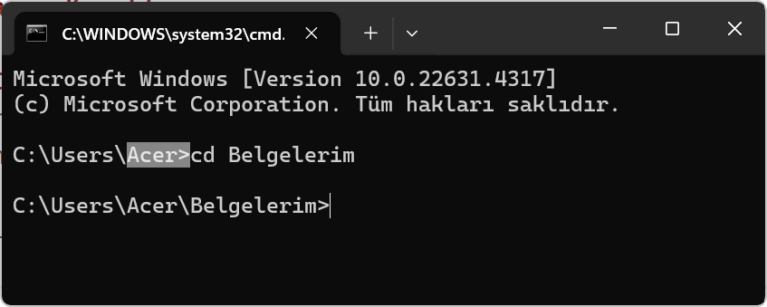

# Linux Komutları

Bu projede en çok kullanılan linux komutlarına yer verilmiştir.

## Klasör Komutları

#### CD komutu
Bu komut klasöre girmek için kullanılır <br>
Kullanım şekli: cd Klasör_Adı
```
cd Belgelerim
```


## Dosya Taşıma ve Kopyalama Komutları

## ....
